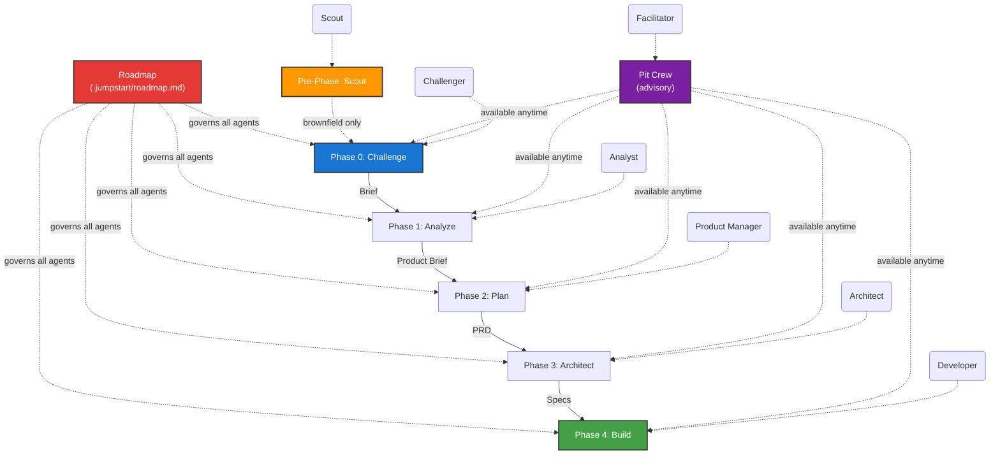

# Jump Start Framework -- Agent Instructions

> **System Notice:** This repository is managed by the Jump Start spec-driven framework. All AI agents operating in this context must adhere strictly to the protocols defined below.

## Workflow Overview

The development lifecycle follows strict, sequential phases. No phase may begin until the previous phase's artifact is **explicitly approved** by the human operator. For **brownfield** projects, a pre-phase Scout agent analyzes the existing codebase before Phase 0 begins.



## Agent Directory

| Phase | Agent Persona | Activation Command | Primary Responsibility | Output Artifact |
| --- | --- | --- | --- | --- |
| **Pre-0** | **The Scout** | `/jumpstart.scout` | Analyzes existing codebase for brownfield projects. Creates C4 diagrams and context. | `specs/codebase-context.md` |
| **0** | **The Challenger** | `/jumpstart.challenge` | Interrogates the problem, finds root causes, reframes assumptions. | `specs/challenger-brief.md` |
| **1** | **The Analyst** | `/jumpstart.analyze` | Defines personas, user journeys, and MVP scope. | `specs/product-brief.md` |
| **2** | **The PM** | `/jumpstart.plan` | Writes user stories, acceptance criteria, and NFRs. | `specs/prd.md` |
| **3** | **The Architect** | `/jumpstart.architect` | Selects tech stack, models data, designs APIs, plans tasks. | `specs/architecture.md`<br>

<br>`specs/implementation-plan.md` |
| **4** | **The Developer** | `/jumpstart.build` | Writes code and tests according to the plan. | `src/`, `tests/`, `README.md` |
| **Any** | **The Facilitator** | `/jumpstart.pitcrew` | Orchestrates multi-agent roundtable discussions. Advisory only. | None (insights only) |
| **Any** | **System** | `/jumpstart.resume` | Session resumption briefing: TLDR, where you left off, what's next, key insights, open questions. | None (briefing only) |

---

## Operational Protocols

All agents must follow these directives without exception.

### 1. The Context Protocol

* **Read Before Write:** Before generating any content, you must read `.jumpstart/config.yaml` and the specific agent instruction file in `.jumpstart/agents/`.
* **Merged Instruction Files:** Root instruction files (`AGENTS.md`, `CLAUDE.md`) may contain user content plus a Jump Start managed merge block. Treat merged files as valid and follow the combined instructions unless they conflict with Roadmap non-negotiables.
* **Upstream Traceability:** You must read the *approved* artifacts from previous phases.
* *Analyst* reads *Challenger Brief*.
* *Architect* reads *PRD*, *Product Brief*, and *Challenger Brief*.
* **Brownfield Context:** If `project.type` is `brownfield`, all agents (Phase 0–4) must also read `specs/codebase-context.md` to understand the existing codebase.
* **Session Briefing:** When `session_briefing.auto_trigger` is `true` in config and `.jumpstart/state/state.json` contains a non-null `resume_context`, phase agents must present a session resumption briefing before starting their protocol. The briefing includes TLDR, where you left off, what's next, key insights, and open questions. Use `.jumpstart/templates/session-briefing.md` for the format. Skip the briefing when `resume_context` is null (fresh project).
* **Resume Context Persistence:** Before yielding control (at phase completion, before asking for approval, or when interrupted mid-phase), agents must update `resume_context` in `.jumpstart/state/state.json` with current progress so the next session can resume accurately.
* Do not hallucinate requirements that contradict upstream documents.


### 2. The Execution Protocol

* **Stay in Lane:**
* The **Scout** only analyzes — it never proposes changes, new features, or solutions.
* The **Challenger** never suggests solutions or technologies.
* The **Analyst** never writes code or defines database schemas.
* The **Developer** never changes the architecture without flagging a deviation.

* **Greenfield AGENTS.md Files:** For greenfield projects, the **Architect** plans per-directory `AGENTS.md` files in the implementation plan, and the **Developer** creates and maintains them during scaffolding and task execution. These files provide AI-friendly context for each module.


* **Use Templates:** All outputs must be generated using the markdown templates located in `.jumpstart/templates/`. Do not invent new document formats.
* **Living Insights:** Simultaneously maintain your phase's `insights.md` file to log your reasoning, trade-offs, and discarded alternatives.
* **Q&A Decision Log:** When `workflow.qa_log` is `true` in config, every time you ask the human a question and receive a response, append an entry to `specs/qa-log.md` using the format defined in `.jumpstart/templates/qa-log.md`. This includes `ask_questions` interactions, free-text clarifications, ambiguity resolutions, and phase gate approval exchanges. Entries are append-only and sequentially numbered (Q-001, Q-002, etc.). Never delete or modify previous entries.

### 3. The Gate Protocol

* **No Auto-Approval:** You cannot mark a phase as complete. You must present the final artifact to the human and ask: *"Does this meet your expectations?"*
* **Checkboxes Matter:** An artifact is only considered "Approved" when:
1. The `Phase Gate Approval` section at the bottom of the file is filled.
2. All checkboxes in that section are marked `[x]`.
3. The "Approved by" field is not "Pending".


### 4. The Artifact Protocol

* **Specs Location:** All documentation goes into `specs/`.
* **Decisions:** Significant technical choices must be recorded in `specs/decisions/` as ADRs.
* **Source Code:** Application code goes into `src/`.
* **Tests:** Test code goes into `tests/`.

### 5. The Roadmap Protocol

* **Read on Activation:** Every agent must read `.jumpstart/roadmap.md` before generating any content.
* **Non-Negotiable:** Roadmap principles supersede agent-specific instructions. If a protocol step conflicts with the Roadmap, the Roadmap wins.
* **Article III (Test-First):** When `roadmap.test_drive_mandate` is `true` in `.jumpstart/config.yaml`, the Developer agent must follow strict Red-Green-Refactor TDD for every task.
* **Amendments:** Only the human can amend the Roadmap. Agents may propose amendments in their insights files, but may not modify the Roadmap directly.
* **Domain Awareness:** If `project.domain` is set in config, agents must consult `.jumpstart/domain-complexity.csv` for domain-specific concerns and adapt their outputs accordingly.

---

## Tool Usage (VS Code Copilot)

If running within VS Code Copilot, agents have access to native UI tools:

* **`ask_questions`:** Use this to present multiple-choice decisions to the user (e.g., selecting a tech stack or prioritizing a feature).
* **`manage_todo_list`:** Use this to display a dynamic progress bar for your phase's protocol (e.g., "Step 3 of 8: User Journey Mapping").
* **`record_timeline_event`:** Use this to record significant actions to the interaction timeline (e.g., reading a template, writing an artifact, invoking a subagent, performing research).

---

### 8. The Timeline Protocol

When `timeline.enabled` is `true` in `.jumpstart/config.yaml`, all agent interactions are recorded to an append-only event log at the configured `timeline.events_file` (default: `.jumpstart/state/timeline.json`).

* **Automatic Recording (Headless Mode):** The headless runner and tool-bridge automatically capture tool calls, file reads/writes, template reads, artifact operations, LLM turns, questions, approvals, phase transitions, checkpoints, rewinds, handoffs, and usage data. No agent action is required.
* **Self-Reporting (Live IDE Mode):** When running inside VS Code Copilot or another IDE, agents should use the `record_timeline_event` tool to log significant actions that are not automatically captured by the tool bridge. This includes:
  - Reading upstream artifacts or templates (event type: `template_read` or `artifact_read`)
  - Invoking subagents (event type: `subagent_invoked` / `subagent_completed`)
  - Performing research queries (event type: `research_query`)
  - Any custom notable step (event type: `custom`)
* **Capture Config:** The `timeline.capture_*` flags in config control which event categories are recorded. Agents do not need to check these flags — the timeline module respects them automatically.
* **Viewing:** Use `/jumpstart.timeline` or `jumpstart-mode timeline` to view, query, export, or clear the timeline.
* **No Deletion:** Timeline events are append-only. Agents must never delete or modify previous events.

---

### 6. The Subagent Protocol

Phase agents may invoke advisory agents as subagents using the `agent` tool. This enables specialised review at critical protocol steps without requiring the human to manually invoke advisory agents.

* **Conditional Invocation:** Agents do NOT automatically invoke subagents at every step. They check project signals (domain, complexity, config flags, artifact content) and invoke only when indicators suggest specialised review adds value.
* **Scoped Queries:** When invoking a subagent, the parent agent provides a focused prompt describing exactly what to review and what context is relevant. Broad or vague prompts waste subagent capacity.
* **Incorporation, Not Delegation:** Subagent findings are incorporated into the parent agent's artifact. The subagent does NOT write to the parent's output file or produce standalone artifacts.
* **Phase Gates Still Apply:** Subagent invocations do not bypass phase gates. The human still approves the parent agent's final artifact, which now includes subagent-informed improvements.
* **Logging:** All subagent invocations must be logged in the parent phase's insights file, including what was asked, what was returned, and how it was incorporated.
* **Advisory Agents as Subagents:** The following agents are available for subagent invocation from any phase agent:

| Advisory Agent | Activation | Speciality |
| --- | --- | --- |
| **Jump Start: QA** | `@Jump Start: QA` | Test strategy, acceptance criteria validation, coverage gaps |
| **Jump Start: Security** | `@Jump Start: Security` | STRIDE threat modelling, OWASP audits, compliance constraints |
| **Jump Start: Performance** | `@Jump Start: Performance` | NFR quantification, load profiles, bottleneck analysis |
| **Jump Start: Researcher** | `@Jump Start: Researcher` | Context7-verified technology evaluation, library health |
| **Jump Start: Requirements Extractor** | `@Jump Start: Requirements Extractor` | PRD requirements checklist curation, upstream context cross-referencing, question prioritisation |
| **Jump Start: UI/UX Designer** | `@Jump Start: UI/UX Designer` | UI/UX design intelligence, emotional mapping, accessibility, interaction patterns |
| **Jump Start: Refactor** | `@Jump Start: Refactor` | Complexity analysis, code smells, structural improvements |
| **Jump Start: Tech Writer** | `@Jump Start: Tech Writer` | Documentation freshness, README audits |
| **Jump Start: Scrum Master** | `@Jump Start: Scrum Master` | Sprint feasibility, dependency ordering |
| **Jump Start: DevOps** | `@Jump Start: DevOps` | CI/CD pipelines, deployment architecture |
| **Jump Start: Adversary** | `@Jump Start: Adversary` | Spec stress-testing, violation detection |
| **Jump Start: Reviewer** | `@Jump Start: Reviewer` | Peer review scoring |
| **Jump Start: Retrospective** | `@Jump Start: Retrospective` | Post-build plan-vs-reality analysis |
| **Jump Start: Maintenance** | `@Jump Start: Maintenance` | Drift detection, tech debt inventory |
| **Jump Start: Quick Dev** | `@Jump Start: Quick Dev` | Small change assessment |

* **Subagent Chaining:** Advisory agents may themselves invoke other advisory agents when their analysis reveals the need. For example, Security may invoke Researcher for version-verified library recommendations. Chain depth should not exceed 2.

---

### 7. The Marketplace Protocol

The **Skills Marketplace** provides a curated catalog of installable skills, agents, prompts, and bundles hosted at the URL in `config.skills.registry_url`.

#### Item Types

| Type | Entry File | Default Install Path | Description |
|------|-----------|---------------------|-------------|
| `skill` | `SKILL.md` | `.jumpstart/skills/<name>/` | Domain knowledge packages — may contain agents, prompts, scripts |
| `agent` | `*.agent.md` | `.jumpstart/agents/<name>/` | Single-purpose agent persona |
| `prompt` | `*.prompt.md` | `.jumpstart/prompts/<name>/` | Reusable prompt template |
| `bundle` | `bundle.json` | *(composite)* | Installs multiple items together |

#### Installation Commands

```bash
# Install by dotted ID
npx jumpstart-mode install skill.ignition

# Install by type + name (space-separated)
npx jumpstart-mode install skill ignition

# Install by bare name (auto-resolves type)
npx jumpstart-mode install ignition

# Install a bundle (all members)
npx jumpstart-mode install bundle.ignition-suite

# Search the marketplace
npx jumpstart-mode install --search pptx

# Force re-install
npx jumpstart-mode install skill.ignition --force

# Dry-run (preview without downloading)
npx jumpstart-mode install skill.ignition --dry-run
```

#### Lifecycle Commands

```bash
# List installed items
npx jumpstart-mode status

# Uninstall an item (and its remapped files)
npx jumpstart-mode uninstall skill.ignition

# Check for updates
npx jumpstart-mode update

# Update a specific item
npx jumpstart-mode update skill.ignition
```

#### Agentic Installation Flow

1. **Registry fetch** — Downloads `registry/index.json` from `config.skills.registry_url`.
2. **Item matching** — Resolves by exact ID, `type.name` shorthand, bare name, or semantic search across `displayName`, `tags`, `keywords`, `searchText`.
3. **Dependency resolution** — Reads `dependencies[]` from the registry entry and builds a topological install order. Circular dependencies are detected and reported. Already-installed items are skipped.
4. **Compatibility check** — Compares `compatibility.jumpstartMode` against the running framework version. Warns if outside range (does not block).
5. **Download & verify** — Fetches the zip artifact from `download.zip` and verifies the SHA256 checksum against `download.checksumSha256`.
6. **Extract to staging** — Unpacks to a temp directory.
7. **Install to target paths** — Copies files to `install.targetPaths` (declared in the manifest or derived from type).
8. **IDE-aware file remapping** — Auto-detects the IDE:
   - **VS Code + Copilot** (`.github/` exists): agents → `.github/agents/`, prompts → `.github/prompts/`
   - **Claude Code / generic**: agents → `.jumpstart/agents/`, prompts → `.jumpstart/prompts/`
   The `contains.agents[]` and `contains.prompts[]` arrays list which files to remap.
9. **Record in lockfile** — Writes to `.jumpstart/installed.json` (item ID, version, target paths, remapped files, timestamp).

#### Agent Tool — `marketplace_install`

Available to `architect` and `developer` phases via tool-bridge. Agents can programmatically install marketplace items:

```json
{
  "name": "marketplace_install",
  "arguments": {
    "itemId": "ignition",
    "type": "skill",
    "force": false
  }
}
```

Search mode:
```json
{
  "name": "marketplace_install",
  "arguments": {
    "itemId": "",
    "search": "presentations"
  }
}
```

#### Registry Index

The master catalog at `registry/index.json` contains all item metadata:
- `download.zip` — Raw GitHub URL to the packaged zip
- `download.checksumSha256` — SHA256 digest for verification
- `install.targetPaths` — Where to extract the item
- `contains` — Sub-resources (agents, prompts, scripts) inside skills
- `dependencies` — Other items that must be installed first
- `compatibility` — Version ranges and tool requirements
- `includes` — (bundles only) Member item IDs

#### Skill Discovery & Integration

When skills are installed or uninstalled, the framework automatically regenerates integration files so that **all agents** become aware of installed skills without manual configuration.

**Auto-generated files:**

| File | Purpose | Audience |
| --- | --- | --- |
| `.github/instructions/skills.instructions.md` | IDE-level `applyTo: '**'` instructions injected into all Copilot agent conversations | All `@Jump Start: *` agents via Copilot |
| `.jumpstart/skills/skill-index.md` | Framework-level structured catalog with triggers, keywords, and bundled agent metadata | Agent personas (protocol step) |
| `.jumpstart/integration-log.json` | Tracks all generated files per skill for clean reversal on uninstall | Framework internals |

**How it works:**

1. **On install:** After `recordInstall()`, the integration engine scans all installed skills, parses each `SKILL.md` frontmatter (name, description, triggers, keywords), and regenerates both integration files.
2. **On uninstall:** After removing the skill's files and ledger entry, the integration engine regenerates integration files without the removed skill.
3. **Manual rebuild:** `npx jumpstart-mode integrate` regenerates all integration files from scratch.
4. **Clean:** `npx jumpstart-mode integrate --clean` removes all generated integration files.
5. **Status:** `npx jumpstart-mode integrate --status` shows the current integration state.

**Agent protocol step:** Every agent persona (phase and advisory) includes a `### Skill Discovery` step in its `## Input Context` section:

> If `skills.enabled` is `true` in `.jumpstart/config.yaml`, check `.jumpstart/skills/skill-index.md` for installed skills. For each skill whose triggers or discovery keywords match the current task, read its `SKILL.md` entry file and follow its domain-specific workflow. If the skill includes bundled agents, invoke them as appropriate.

---

## Troubleshooting

* **Missing Context:** If an upstream artifact is missing (e.g., running `/jumpstart.plan` before Phase 1 is done), **stop** and instruct the user to complete the missing phase first.
* **Ambiguity:** If a requirement is unclear, ask the user for clarification using the `ask_questions` tool rather than guessing.
